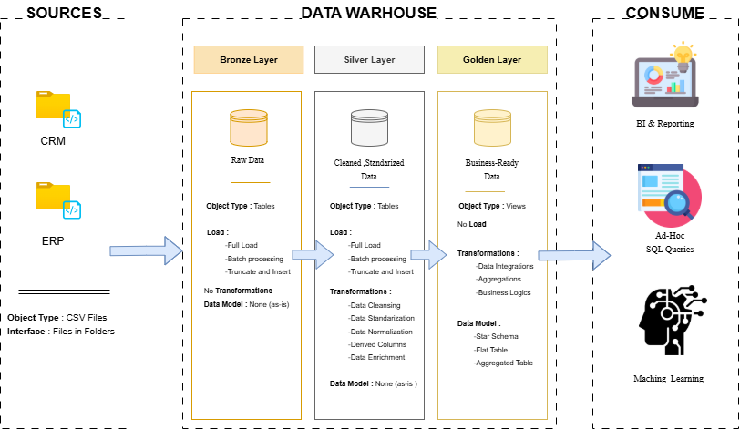

# sql-data-warehouse-project
Building a moden data warehouse with SQL Server , including ETL processes , data modeling , and analytics
Project Requirements

# SQL Data Warehouse Project

[](https://www.microsoft.com/en-us/sql-server)
[](LICENSE)

## 📌 Overview

This project demonstrates a **modern data warehousing and analytics solution** using **SQL Server**. It covers the complete workflow:

- Data ingestion from multiple source systems (ERP & CRM) as CSV files  
- Data cleaning and quality checks  
- Data modeling using the **Bronze → Silver → Gold** layered architecture  
- Business analytics and reporting with SQL  

> Designed as a portfolio project, it follows industry best practices for data engineering and analytics.

---

## 🎯 Project Requirements

### 1. Data Warehousing (Data Engineering)

**Objective**  
Build a modern data warehouse to consolidate sales data, enabling analytical reporting and informed decision‑making.

**Specifications**

- **Data Sources** – ERP and CRM systems (CSV exports).  
- **Data Quality** – Cleanse and resolve inconsistencies before analysis.  
- **Integration** – Combine both sources into a single, user‑friendly data model.  
- **Scope** – Latest dataset only (no historization required).  
- **Documentation** – Provide clear documentation for business and analytics teams.

### 2. Analytics & Reporting (Data Analytics)

**Objective**  
Deliver detailed insights on:

- **Customer behavior**  
- **Product performance**  
- **Sales trends**  

These insights empower stakeholders with key business metrics for strategic decision‑making.

---

## 🧱 Data Architecture (Layered Approach)

This project uses the **medallion architecture** (Bronze, Silver, Gold):

| Layer | Purpose |
|-------|---------|
| **Bronze** | Raw data as loaded from source CSVs – no transformations. |
| **Silver** | Cleaned, standardized, and quality‑checked data (deduplicated, validated). |
| **Gold** | Business‑ready dimension & fact tables (star schema) optimized for analytics. |

 *Add your diagram here*

---

## 📂 Repository Structure
sql-data-warehouse-project/
├── docs/
│ ├── data_model.md
│ └── etl_pipeline.md
├── scripts/
│ ├── 01_bronze/
│ ├── 02_silver/
│ ├── 03_gold/
│ └── 04_analytics/
├── data/
│ ├── erp_customers.csv
│ ├── erp_products.csv
│ └── crm_sales.csv
├── config/
├── tests/
├── .gitignore
├── README.md
└── LICENSE


---

## 🚀 Getting Started

### Prerequisites

- **SQL Server** (2019 or later) – Developer Edition is free.  
- **SQL Server Management Studio (SSMS)** or Azure Data Studio.  
- **Git** (to clone the repository).

### Installation

1. **Clone the repository**
   ```bash
   git clone https://github.com/yourusername/sql-data-warehouse-project.git
   cd sql-data-warehouse-project
